# CNN 구조와 XAI 분석 시각 가이드

이 문서는 현재 프로젝트의 `XAI/CNN` 모델을 처음 보는 사람이 구조와 XAI 결과를 한 번에 이해할 수 있도록 만든 시각 설명서이다. 기준 파일은 `XAI/CNN/xai_methods/model.py`, 실행 결과는 `XAI/CNN/xai_outputs` 아래 산출물이다.

## 1. 한 장 요약

현재 CNN은 영화 리뷰 문장을 Okt 형태소 token으로 바꾼 뒤, 최대 30개 token만 사용해 긍정/부정을 분류하는 TextCNN이다.

| 항목 | 현재 값 |
| --- | --- |
| 입력 단위 | Okt 형태소 token |
| 입력 길이 | `max_len=30` |
| vocabulary size | `25,954` |
| embedding dim | `128` |
| convolution branch | filter size `3`, `4`, `5` |
| filters per branch | `100` |
| pooled feature 수 | `3 x 100 = 300` |
| classifier | `Linear(300, 2)` |
| dropout | `0.5` |
| class | `0=부정`, `1=긍정` |
| XAI target class | 기본값은 모델이 예측한 class |

핵심 직관은 다음 한 문장이다.

> 이 모델은 단어 하나를 직접 읽는다기보다, 3/4/5개 형태소가 이어진 감정 표현을 filter가 감지하고, 각 filter가 문장 전체에서 가장 강한 위치 하나를 고른 뒤, 그 300개 evidence를 조합해 긍정/부정을 정한다.

## 2. 전체 처리 흐름

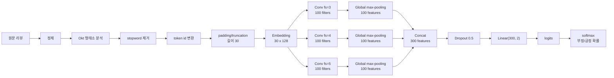

### Tensor shape로 보기

| 단계 | shape | 의미 |
| --- | --- | --- |
| token ids | `[batch, 30]` | padding까지 끝난 입력 id |
| embedding | `[batch, 30, 128]` | 각 형태소 token을 128차원 벡터로 표현 |
| channel 추가 | `[batch, 1, 30, 128]` | `Conv2d` 입력을 위한 1-channel 텍스트 이미지 |
| conv fs=3 | `[batch, 100, 28]` | 3-token window가 이동하며 만든 activation |
| conv fs=4 | `[batch, 100, 27]` | 4-token window activation |
| conv fs=5 | `[batch, 100, 26]` | 5-token window activation |
| max-pooling | `[batch, 100]` per branch | filter마다 가장 강한 위치 하나만 남김 |
| concat | `[batch, 300]` | `fs=3/4/5` branch의 pooled feature 연결 |
| linear | `[batch, 2]` | 부정 logit, 긍정 logit |

코드상 핵심은 `embedding -> Conv2d -> ReLU -> torch.max -> concat -> fc`이다. 특히 `Conv2d` kernel은 `(filter_size, 128)`이라서, 세로로는 3/4/5개 token을 보고 가로로는 embedding 전체 128차원을 한 번에 덮는다.

## 3. CNN filter가 보는 것

예를 들어 token sequence가 다음처럼 들어왔다고 하자.

```text
position:  0      1       2       3       4       5
tokens:   너무   지루하다  않다    감동     적       이다
```

filter size별 window는 이렇게 생긴다.

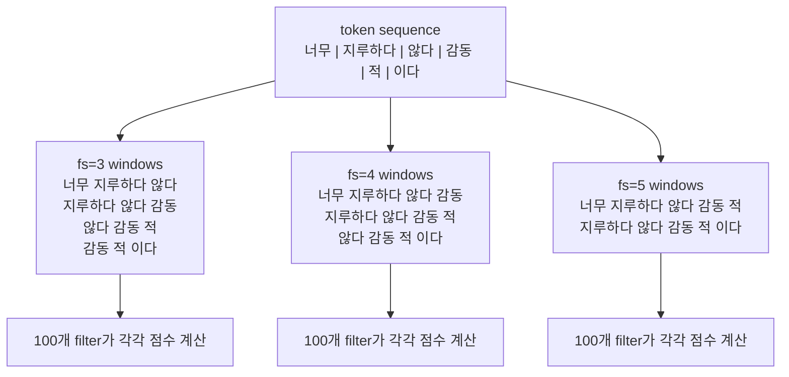

각 filter는 "이런 형태의 표현이 보이면 강하게 반응한다"는 패턴 감지기처럼 볼 수 있다. 다만 activation만으로 긍정/부정을 바로 말할 수는 없다. 마지막 `fc.weight`가 그 filter feature를 긍정 쪽으로 쓸지, 부정 쪽으로 쓸지 결정한다.

```text
class logit = bias + sum(pooled_feature_j * fc_weight[class, j])

positive_direction_j = fc_weight[positive, j] - fc_weight[negative, j]
target_contribution_j = pooled_feature_j * fc_weight[target_class, j]
```

feature index 범위는 다음처럼 나뉜다.

| branch | filter size | feature index |
| --- | --- | --- |
| branch 1 | `3` | `0-99` |
| branch 2 | `4` | `100-199` |
| branch 3 | `5` | `200-299` |

## 4. 같은 구조 위에서 XAI가 보는 위치

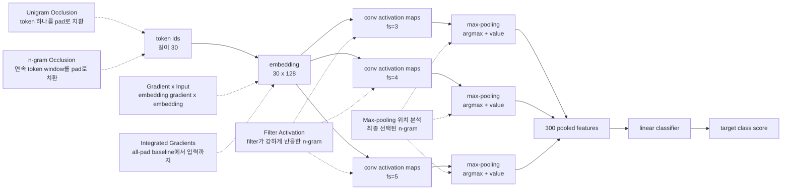

이 그림을 기준으로 보면 각 XAI 기법의 질문이 분명해진다.

| XAI 기법 | 보는 위치 | 분석 단위 | 묻는 질문 | 현재 산출물 |
| --- | --- | --- | --- | --- |
| Unigram Occlusion | 입력 token id | token 1개 | 이 token을 가리면 target 확률이 얼마나 떨어지는가? | `cnn_unigram_occlusion.csv` |
| n-gram Occlusion | 입력 token id | 연속 1-5 token | 이 구간을 가리면 target 확률이 얼마나 떨어지는가? | `cnn_ngram_occlusion.csv` |
| Filter Activation | conv activation map | filter별 최고 n-gram | 각 filter는 어떤 n-gram에 가장 강하게 반응했는가? | `cnn_filter_top_ngrams.csv` |
| Filter Class Direction | classifier weight | filter feature | 이 filter feature는 긍정/부정 어느 방향인가? | `cnn_filter_class_direction.csv` |
| Max-pooling 위치 분석 | pooling argmax | filter가 선택한 n-gram | 최종 classifier까지 살아남은 evidence는 무엇인가? | `cnn_maxpool_positions.csv` |
| Gradient x Input | embedding | token별 gradient attribution | 현재 입력 주변에서 target logit은 어떤 token에 민감한가? | `cnn_gradient_x_input.csv` |
| Integrated Gradients | embedding path | token별 path attribution | all-pad baseline에서 실제 입력으로 올 때 어느 token이 점수를 만들었는가? | `cnn_integrated_gradients.csv` |
| Grad-CAM for Text CNN | conv feature map gradient | 위치별 activation heatmap | class score를 올린 conv 위치는 어디인가? | 현재는 선택 확장용 |

## 5. Occlusion 계열

Occlusion은 가장 직관적인 설명 방식이다. 입력 일부를 `<pad>`로 바꾼 뒤 모델을 다시 돌려서 target class 확률이 얼마나 줄어드는지 본다.

```text
prob_drop = P(target | original) - P(target | masked)
logit_drop = logit(target | original) - logit(target | masked)
```

`prob_drop > 0`이면 그 부분을 가렸을 때 target class 확률이 내려갔다는 뜻이다. 즉 모델이 그 부분을 target class 판단 근거로 사용했다고 해석할 수 있다.

### 5.1 Unigram Occlusion

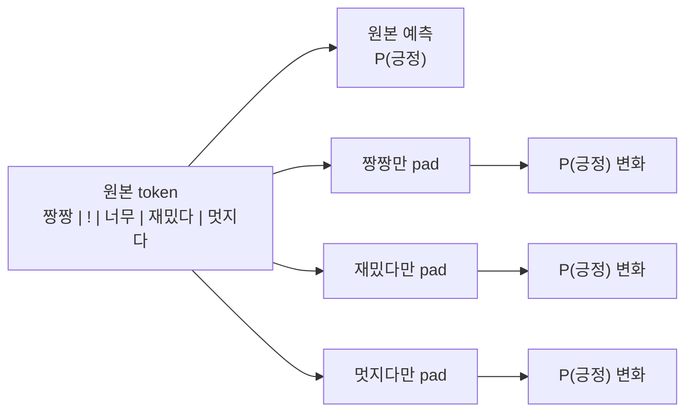

Unigram은 token 하나의 독립 기여를 빠르게 보기 좋다. 하지만 CNN은 filter window로 여러 token을 함께 보므로, token 하나만 가렸을 때는 영향이 작게 보일 수 있다.

프로젝트 사례에서 `굳다 / 굳다 / 굳다 / 굳다 / 굳다` 문장은 unigram occlusion의 `prob_drop`이 token별로 약 `0.0001` 수준이었다. 반면 같은 문장의 5-gram 전체를 가리면 `prob_drop=0.5453`까지 올라갔다. 이 차이가 TextCNN의 핵심을 잘 보여 준다.

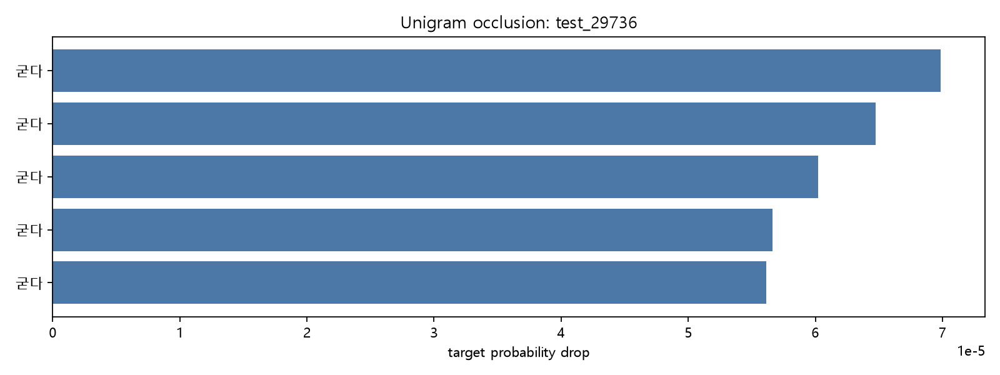

### 5.2 n-gram Occlusion

n-gram occlusion은 이 CNN에서 가장 중요한 입력 제거 기반 XAI이다. 이유는 모델의 convolution filter가 정확히 3/4/5-token window를 보기 때문이다.

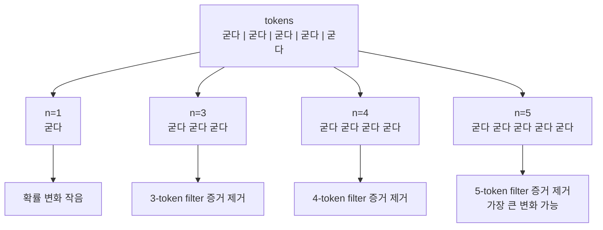

현재 실행 결과에서 큰 영향을 준 n-gram 예시는 다음과 같다.

| sample | target | n-gram | n | prob_drop |
| --- | --- | --- | --- | --- |
| `test_46976` | 부정 | `시사회 환경 증말 최악 !` | 5 | `0.9661` |
| `test_46976` | 부정 | `증말 최악` | 2 | `0.9490` |
| `test_28405` | 부정 | `이재용 감독 발연기` | 3 | `0.9460` |
| `custom_4` | 긍정 | `않다 감동 적 이다` | 4 | `0.9273` |
| `test_29736` | 긍정 | `굳다 굳다 굳다 굳다 굳다` | 5 | `0.5453` |

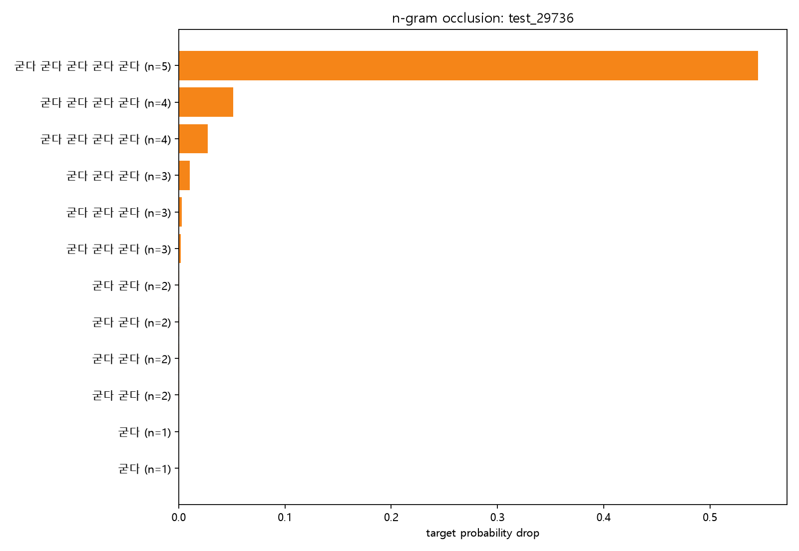

## 6. Filter Activation 분석

Filter activation은 입력을 지우는 방식이 아니라 CNN 내부를 직접 보는 방법이다.

각 branch의 activation map은 다음 의미를 갖는다.

```text
fs=3 activation shape: [1, 100, 28]
                  = [batch, filter_idx, window_position]
```

filter `k`에 대해 위치별 activation을 보면, 그 filter가 문장 안의 어느 n-gram에 가장 강하게 반응했는지 알 수 있다.

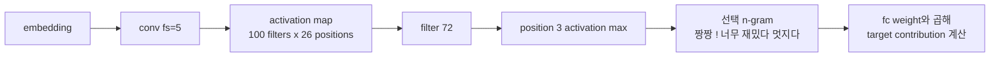

중요한 점은 "세게 반응했다"와 "긍정 근거다"가 항상 같지 않다는 것이다. activation은 패턴 감지 강도이고, class 방향은 `fc.weight`가 정한다.

```text
positive_direction = fc.weight[1, feature_idx] - fc.weight[0, feature_idx]
direction_label = positive_direction >= 0 ? positive : negative
target_contribution = activation * fc.weight[target_class, feature_idx]
```

실제 실행 결과의 상위 filter activation 예시는 다음과 같다.

| sample | filter | n-gram | direction | target contribution |
| --- | --- | --- | --- | --- |
| `test_14941` | `fs=5, filter=72` | `짱짱 ! 너무 재밌다 멋지다` | positive | `0.6569` |
| `test_38513` | `fs=4, filter=59` | `4 점도 아깝다 ..` | negative | `0.4642` |
| `test_29736` | `fs=4, filter=37` | `굳다 굳다 굳다 굳다` | positive | `0.4473` |
| `test_47633` | `fs=4, filter=11` | `시간 아깝다 평점 1` | negative | `0.4299` |
| `custom_2` | `fs=3, filter=10` | `최악 이고 시간` | negative | `0.3798` |

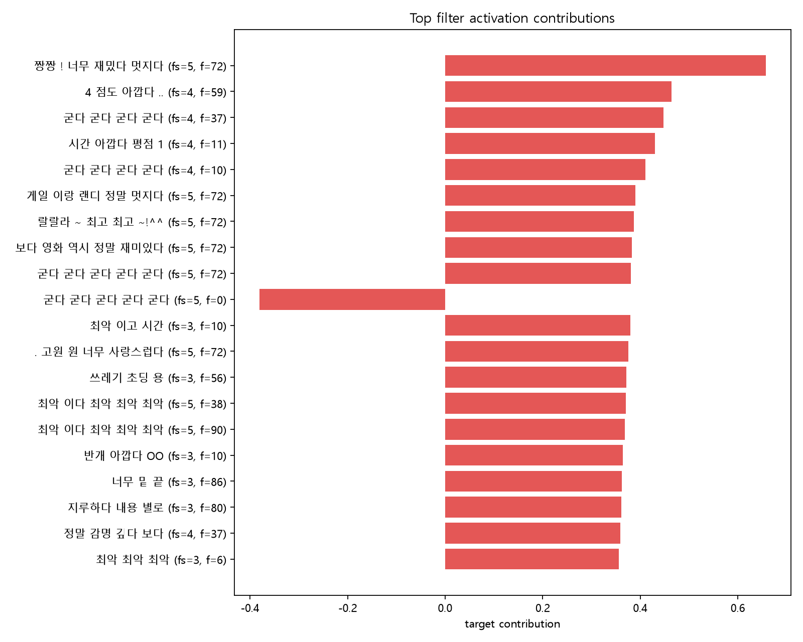

## 7. Max-pooling 위치 분석

TextCNN의 global max-pooling은 각 filter가 문장 전체에서 딱 하나의 위치만 최종 feature로 남기는 단계이다. 그래서 max-pooling 위치 분석은 "최종 판단에 살아남은 n-gram evidence"를 찾는 분석이다.

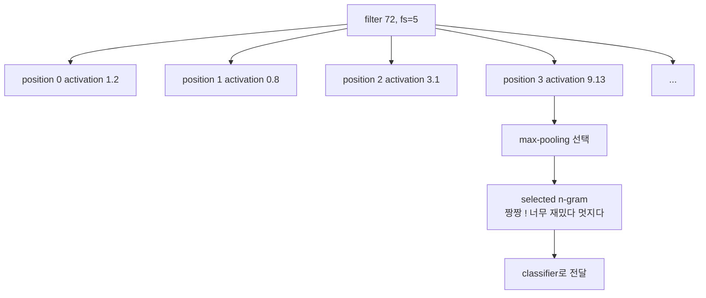

Filter activation 분석이 "어떤 filter가 무엇에 반응했나"라면, max-pooling 분석은 "그 반응 중 classifier까지 실제로 전달된 것이 무엇인가"를 보여 준다.

현재 상위 max-pooling contribution 예시는 다음과 같다.

| sample | filter | selected n-gram | max position | target contribution |
| --- | --- | --- | --- | --- |
| `test_14941` | `fs=5, filter=72` | `짱짱 ! 너무 재밌다 멋지다` | `3` | `0.6569` |
| `test_38513` | `fs=4, filter=59` | `4 점도 아깝다 ..` | `0` | `0.4642` |
| `test_29736` | `fs=4, filter=37` | `굳다 굳다 굳다 굳다` | `0` | `0.4473` |
| `test_47633` | `fs=4, filter=11` | `시간 아깝다 평점 1` | `8` | `0.4299` |
| `test_21695` | `fs=5, filter=72` | `게일 이랑 랜디 정말 멋지다` | `12` | `0.3900` |

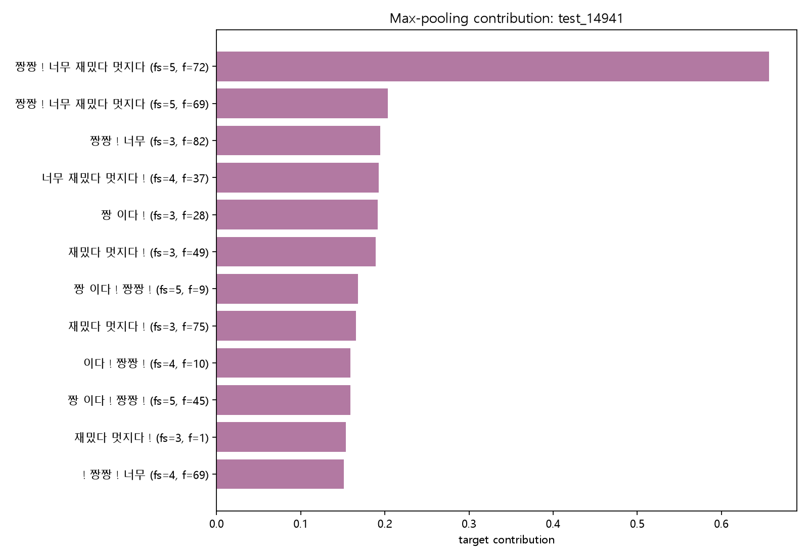

## 8. Gradient x Input

Gradient x Input은 embedding 공간에서 target logit이 각 token embedding에 얼마나 민감한지 보는 방법이다.

```text
signed_score_i = sum(gradient_i * embedding_i)
normalized_abs_score_i = abs(signed_score_i) / max(abs(score over real tokens))
```

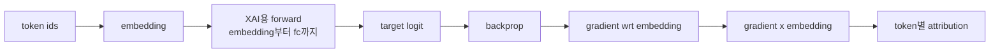

해석은 다음처럼 한다.

| 값 | 의미 |
| --- | --- |
| signed score 양수 | target class logit을 올리는 방향 |
| signed score 음수 | target class logit을 낮추는 방향 |
| normalized abs score 큼 | 현재 입력 주변에서 민감도가 큼 |

이 방법은 한 번의 backward로 빠르게 token-level 중요도를 볼 수 있다. 다만 CNN filter window 때문에 중요도가 주변 token으로 퍼질 수 있고, 현재 한 점에서의 local sensitivity라서 occlusion이나 IG와 함께 보는 것이 좋다.

`test_14941`에서 Gradient x Input은 `재밌다`, `짱짱`, `멋지다`를 강하게 표시했다.

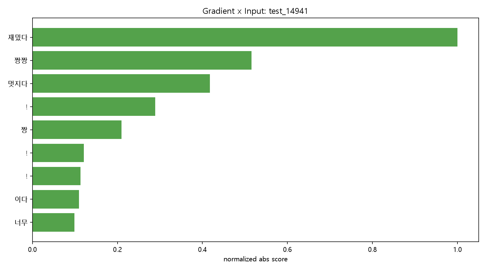

## 9. Integrated Gradients

Integrated Gradients는 `<pad>`만 있는 baseline에서 실제 입력 embedding까지 천천히 이동하면서 gradient를 누적한다. 현재 실행은 `ig_steps=32`이다.

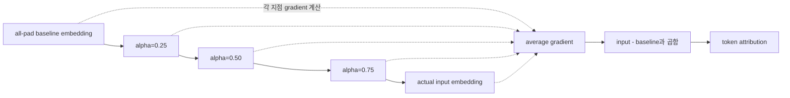

```text
baseline = embedding(<pad>, <pad>, ..., <pad>)
path(alpha) = baseline + alpha * (input_embedding - baseline)
IG = (input_embedding - baseline) * average_gradient_along_path
```

Gradient x Input이 "현재 점에서의 민감도"라면, Integrated Gradients는 "빈 입력에서 실제 입력이 만들어지는 전체 경로에서 누적된 기여"에 가깝다. 그래서 token attribution 지표로는 IG가 더 안정적인 보조 설명이다.

`test_14941`에서 IG도 `재밌다`, `짱짱`, `멋지다`를 강하게 표시해 Gradient x Input과 비슷한 결론을 준다.

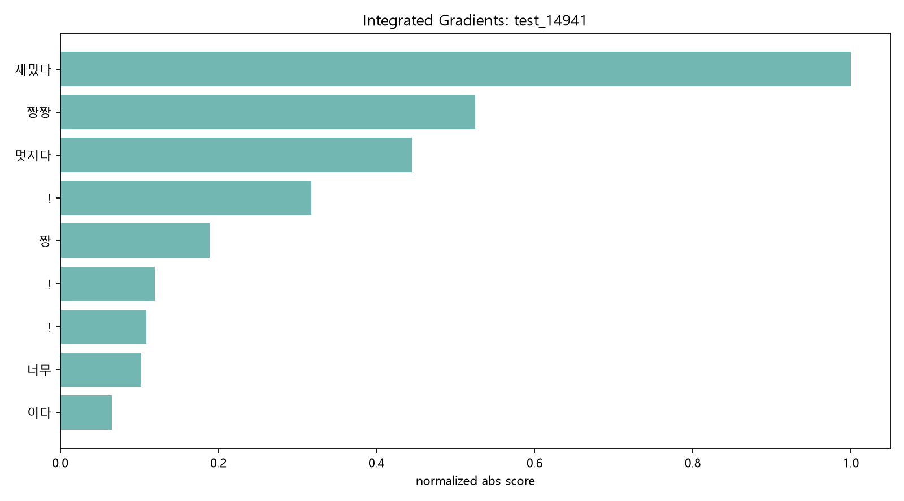

## 10. 기법별로 답할 수 있는 질문

| 질문 | 가장 직접적인 기법 | 이유 |
| --- | --- | --- |
| 이 모델이 문장 어느 구간 때문에 긍정/부정을 냈나? | n-gram Occlusion, Max-pooling 위치 | CNN filter window와 직접 맞는다 |
| 단어 하나씩 보면 무엇이 중요했나? | Unigram Occlusion, Gradient x Input, IG | token-level attribution을 준다 |
| 특정 filter는 어떤 표현을 감지하나? | Filter Activation | conv activation map을 직접 본다 |
| filter가 긍정용인지 부정용인지 어떻게 아나? | Filter Class Direction | 마지막 `fc.weight`의 class별 차이를 본다 |
| 최종 classifier까지 실제로 살아남은 evidence는 무엇인가? | Max-pooling 위치 | global max-pooling argmax 위치가 최종 feature다 |
| 오분류에서 모델이 잘못 본 근거는 무엇인가? | predicted target 기준 XAI + true target 기준 비교 | 기본 target은 predicted class이고, 필요하면 true class로 다시 계산한다 |
| 발표에서 가장 직관적인 그림은 무엇인가? | n-gram Occlusion + Max-pooling + Filter Activation | "가리면 확률이 떨어짐", "filter가 고른 구간", "classifier 기여도"를 같이 보여 줄 수 있다 |

## 11. 읽는 순서 추천

처음 설명할 때는 다음 순서가 가장 자연스럽다.

1. Okt 형태소 token과 `max_len=30`을 먼저 보여 준다.
2. 3/4/5-token window를 convolution filter가 훑는 그림을 보여 준다.
3. global max-pooling이 filter마다 가장 강한 n-gram 하나를 남긴다는 점을 설명한다.
4. `300 features -> Linear(300, 2)`에서 긍정/부정 점수가 만들어진다고 설명한다.
5. n-gram occlusion으로 "이 구간을 가리면 확률이 떨어진다"를 보여 준다.
6. filter activation으로 "내부 filter도 같은 구간에 강하게 반응했다"를 보여 준다.
7. max-pooling 위치로 "그 구간이 실제 classifier까지 살아남았다"를 보여 준다.
8. Gradient x Input과 IG로 token-level 보조 설명을 덧붙인다.

## 12. 주요 산출물 위치

| 파일 | 내용 |
| --- | --- |
| `xai_outputs/cnn_xai_selected_samples.csv` | XAI에 사용한 test/custom sample 목록 |
| `xai_outputs/cnn_unigram_occlusion.csv` | token 하나씩 가렸을 때 확률/logit 변화 |
| `xai_outputs/cnn_ngram_occlusion.csv` | 연속 n-token window를 가렸을 때 변화 |
| `xai_outputs/cnn_filter_top_ngrams.csv` | filter별 가장 강한 n-gram과 class contribution |
| `xai_outputs/cnn_filter_class_direction.csv` | filter feature의 긍정/부정 방향성 |
| `xai_outputs/cnn_maxpool_positions.csv` | max-pooling이 선택한 위치와 selected n-gram |
| `xai_outputs/cnn_gradient_x_input.csv` | Gradient x Input token attribution |
| `xai_outputs/cnn_integrated_gradients.csv` | Integrated Gradients token attribution |
| `xai_outputs/cnn_xai_case_summary.md` | 대표 사례별 요약 보고서 |
| `xai_outputs/figures/*.png` | 발표/보고서에 바로 넣을 수 있는 그래프 |

## 13. 주의해서 해석할 점

1. 여기서 token은 사람이 보는 띄어쓰기 단어가 아니라 Okt 형태소 token이다.
2. `max_len=30` 이후 잘린 token은 모델 입력에 없으므로 XAI 설명 대상도 아니다.
3. Occlusion은 삭제가 아니라 `<pad>` 치환이다. 삭제하면 뒤 token 위치가 당겨져 CNN window가 바뀌기 때문이다.
4. Unigram occlusion이 작게 나와도 그 단어가 중요하지 않다는 뜻은 아닐 수 있다. CNN은 여러 token을 묶은 n-gram으로 강하게 반응할 수 있다.
5. Filter activation이 크다고 바로 긍정/부정 근거가 되는 것은 아니다. 반드시 `fc.weight` 방향성과 같이 봐야 한다.
6. Gradient x Input과 Integrated Gradients는 embedding 기반 token attribution이다. filter window를 직접 보여 주는 설명은 n-gram occlusion, filter activation, max-pooling 분석이 더 직관적이다.
7. 현재 Grad-CAM for Text CNN은 필수 구현 산출물이 아니라 발표 확장용 아이디어에 가깝다. 이 모델은 global max-pooling 구조라 max-pooling 위치 분석이 Grad-CAM보다 직접적이다.

## 14. 가장 짧은 발표용 결론

이 프로젝트의 CNN은 형태소 30개를 128차원 embedding으로 바꾼 뒤, 3/4/5개 형태소 window를 보는 300개 filter feature를 만든다. 각 filter는 문장 전체에서 가장 강하게 반응한 위치 하나만 max-pooling으로 남기고, 마지막 linear layer가 그 evidence를 긍정/부정 점수로 합산한다. XAI 결과를 보면 단일 token보다 `짱짱 ! 너무 재밌다 멋지다`, `시간 아깝다 평점 1`, `굳다 굳다 굳다 굳다 굳다` 같은 연속 n-gram이 모델 판단을 크게 흔든다. 따라서 이 CNN의 설명은 "어떤 단어가 중요했는가"보다 "어떤 형태소 n-gram 패턴이 filter에 잡혔고, 그중 무엇이 max-pooling을 통과해 classifier에 기여했는가"로 보는 것이 가장 정확하다.
